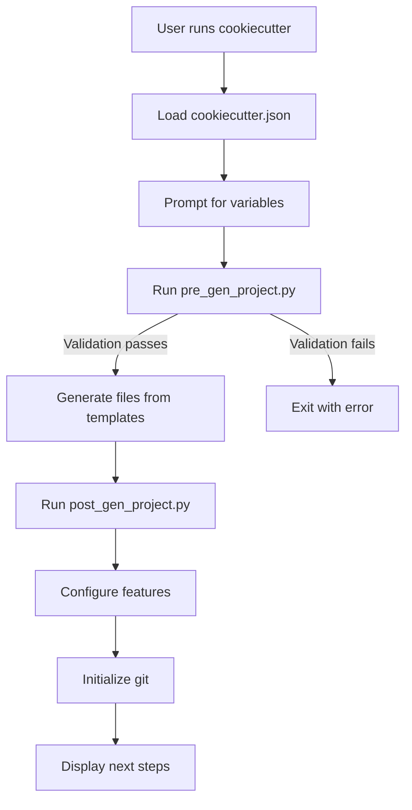

<!--
SPDX-FileCopyrightText: Copyright (c) 2025 Broadsage <opensource@broadsage.com>

SPDX-License-Identifier: Apache-2.0
-->

# docker-scaffold

> **Ansible-powered Cookiecutter template for professional Docker image repositories**

A production-ready template for generating Docker image projects with built-in compliance, security scanning, multi-architecture builds, and comprehensive CI/CD integration.

[](LICENSE)
[](https://conventionalcommits.org)
[](https://github.com/cookiecutter/cookiecutter)

---

## 🎯 Features

### ⚡ **Quick Start**

- **One-command generation**: `cookiecutter gh:broadsage/docker-scaffold`
- **Interactive prompts** with sensible defaults
- **Automated project setup** via post-generation hooks

### 🏗️ **Production-Ready**

- ✅ **Multi-architecture builds** (linux/amd64, linux/arm64)
- ✅ **GitHub Actions CI/CD** workflows
- ✅ **Container registry integration** (GHCR, Docker Hub)
- ✅ **Security scanning** (Trivy, Grype)
- ✅ **SBOM generation** (SPDX, CycloneDX)

### 📋 **Compliance & Quality**

- ✅ **Commit validation** (Conventional Commits via Conform)
- ✅ **Multi-language linting** (MegaLinter)
- ✅ **License compliance** (REUSE/SPDX headers)
- ✅ **Pre-commit hooks** for automated checks

### 🔧 **Developer Experience**

- ✅ **Task automation** (Taskfile.yml)
- ✅ **Docker Compose** for local development
- ✅ **VS Code integration** with recommended extensions
- ✅ **Comprehensive documentation**

---

## 📦 Quick Start

### Prerequisites

```bash
# Required
pip install cookiecutter

# Optional but recommended
brew install yq task

# Or use the installation script
bash <(curl -fsSL https://raw.githubusercontent.com/broadsage/docker-scaffold/main/install-cookiecutter.sh)
```

### Generate Your First Project

```bash
# Interactive mode (recommended)
cookiecutter gh:broadsage/docker-scaffold

# Follow prompts:
# organization [broadsage]: mycompany
# project_name [my-docker-image]: nginx-custom
# project_short_description: Custom NGINX with SSL modules
# ...

# Result:
cd nginx-custom/
task build
```

### Non-Interactive Mode

```bash
cookiecutter gh:broadsage/docker-scaffold \
  --no-input \
  organization="mycompany" \
  project_name="nginx-custom" \
  project_short_description="Custom NGINX with SSL"
```

---

## 📚 Documentation

| Document | Description |
|----------|-------------|
| **[Template Usage Guide](docs/template-usage.md)** | Complete Cookiecutter usage documentation |
| **[Cookiecutter Examples](examples/cookiecutter-examples.md)** | Real-world generation examples |
| **[Conform Guide](docs/conform-guide.md)** | Commit message best practices |
| **[Contributing](CONTRIBUTING.md)** | How to contribute to this template |

---

## 🎨 What Gets Generated?

When you run cookiecutter, you get a fully-configured project:

```bash
your-project/
├── 📄 Dockerfile                    # Multi-stage, optimized build
├── 📄 docker-compose.yml            # Local development
├── 📄 Taskfile.yml                  # Task automation
├── 📄 project.yaml                  # Project configuration
│
├── 🔧 .conform.yaml                 # Commit validation
├── 🔧 .mega-linter.yaml             # Code linting
├── 🔧 .pre-commit-config.yaml       # Pre-commit hooks
├── 🔧 REUSE.toml                    # License compliance
│
├── 🐙 .github/
│   ├── workflows/
│   │   ├── build.yml               # Docker image build
│   │   ├── security.yml            # Vulnerability scanning
│   │   └── compliance.yml          # Code quality
│   ├── ISSUE_TEMPLATE/             # Bug reports, features
│   └── PULL_REQUEST_TEMPLATE.md
│
├── 📦 ansible/
│   ├── generate.yaml               # Project generator
│   ├── roles/
│   │   ├── compliance/             # Compliance configs
│   │   ├── documentation/          # Docs generation
│   │   ├── github/                 # GitHub templates
│   │   └── repository/             # Repo structure
│   └── vars/
│       └── defaults.yaml           # Org-wide defaults
│
├── 📖 docs/
│   ├── conform-guide.md            # Commit guidelines
│   └── ...
│
├── 🔨 scripts/
│   ├── compliance.py               # Compliance runner
│   └── merge_config.py             # Config merger
│
└── 📜 README.md                     # Generated project README
```

---

## ⚙️ Configuration

### Template Variables

Configure your generated project with these variables:

| Variable | Description | Default |
|----------|-------------|---------|
| `organization` | GitHub org/username | `broadsage` |
| `project_name` | Human-readable name | `my-docker-image` |
| `project_slug` | URL-safe identifier | *auto-generated* |
| `maintainer_name` | Your name | `Broadsage` |
| `maintainer_email` | Your email | `opensource@broadsage.com` |
| `license` | License type | `Apache-2.0` |
| `build_platforms` | Target platforms | `multi-arch` |

**See:** [Template Usage Guide](docs/template-usage.md#template-variables) for full list.

### Organization Defaults

Create `~/.cookiecutterrc` for team-wide defaults:

```yaml
default_context:
  organization: "mycompany"
  maintainer_name: "DevOps Team"
  maintainer_email: "devops@mycompany.com"
  license: "MIT"
  build_platforms: "multi-arch (amd64 + arm64)"
  features_security: "y"
  features_compliance: "y"
```

---

## 🚀 Usage Examples

### Example 1: Minimal Setup

```bash
cookiecutter gh:broadsage/docker-scaffold \
  --no-input \
  project_name="simple-nginx" \
  features_compliance="n" \
  features_security="n"
```

### Example 2: Production-Ready

```bash
cookiecutter gh:broadsage/docker-scaffold \
  --no-input \
  organization="mycompany" \
  project_name="api-gateway" \
  build_platforms="multi-arch (amd64 + arm64)" \
  features_github="y" \
  features_security="y" \
  compliance_conform="y" \
  compliance_megalinter="y"
```

### Example 3: CI/CD Integration

```yaml
# GitHub Action
- name: Generate project
  run: |
    cookiecutter gh:broadsage/docker-scaffold \
      --no-input \
      project_name="${{ inputs.name }}" \
      organization="${{ github.repository_owner }}"
```

**More examples:** [Cookiecutter Examples](examples/cookiecutter-examples.md)

---

## 🏗️ Architecture

### Template Structure

```
docker-scaffold/
├── cookiecutter.json              # Template configuration
├── hooks/                         # Generation hooks
│   ├── pre_gen_project.py        # Validation
│   └── post_gen_project.py       # Automation
├── {{cookiecutter.project_slug}}/ # Generated project
│   ├── Dockerfile
│   ├── project.yaml              # Uses {{cookiecutter.var}}
│   ├── ansible/
│   │   └── vars/
│   │       └── defaults.yaml     # Uses {{cookiecutter.var}}
│   └── README.md                 # Uses {{cookiecutter.var}}
└── docs/                          # Documentation
```

### Generation Flow



---

## 🔧 Development

### Local Testing

```bash
# Clone template
git clone https://github.com/broadsage/docker-scaffold.git
cd docker-scaffold

# Test generation locally
cookiecutter . --overwrite-if-exists

# Iterate on template
# ... make changes ...
cookiecutter . --overwrite-if-exists
```

### Contributing

We welcome contributions! See [CONTRIBUTING.md](CONTRIBUTING.md) for guidelines.

```bash
# Fork and clone
git clone https://github.com/YOUR_USERNAME/docker-scaffold.git

# Create feature branch
git checkout -b feat/amazing-feature

# Make changes and test
cookiecutter . --overwrite-if-exists

# Commit using conventional commits
git commit -s -m "feat: add amazing feature"

# Push and create PR
git push origin feat/amazing-feature
```

---

## 📊 Compliance

This template enforces:

- ✅ **Conventional Commits** - Standardized commit messages
- ✅ **DCO Sign-off** - Developer Certificate of Origin
- ✅ **GPG Signing** - Commit verification
- ✅ **SPDX Headers** - License compliance
- ✅ **Code Linting** - Multi-language quality checks

**Configure:** Customize compliance in `ansible/vars/defaults.yaml`

```yaml
compliance:
  conform: true      # Commit validation
  megalinter: true   # Code linting  
  reuse: true        # License headers
```

---

## 🔐 Security

- **Automated scanning** with Trivy and Grype
- **SBOM generation** for supply chain security
- **Dependabot** for dependency updates
- **CodeQL** for code analysis
- **Secret scanning** via GitHub Advanced Security

---

## 🛠️ Task Automation

Generated projects include a Taskfile with common tasks:

```bash
task -l                  # List all available tasks
task build               # Build Docker image
task push                # Push to registry
task compliance          # Run all compliance checks
task lint                # Run code linters
task test                # Run tests
task clean               # Clean build artifacts
```

---

## 📈 Roadmap

- [ ] Support for additional languages (Go, Rust, Java)
- [ ] Kubernetes manifest generation
- [ ] Helm chart scaffolding
- [ ] ArgoCD GitOps integration
- [ ] Terraform module generation
- [ ] OpenTelemetry instrumentation

---

## 🤝 Community

- **GitHub Issues**: [Report bugs or request features](https://github.com/broadsage/docker-scaffold/issues)
- **GitHub Discussions**: [Ask questions or share ideas](https://github.com/broadsage/docker-scaffold/discussions)
- **Email**: <opensource@broadsage.com>

---

## 📄 License

This project is licensed under the Apache License 2.0 - see [LICENSE](LICENSE) for details.

### REUSE Compliance

This project follows the [REUSE Specification](https://reuse.software/spec/). All files contain SPDX license headers.

```bash
# Verify REUSE compliance
docker run --rm -v $(pwd):/data fsfe/reuse:latest lint
```

---

## 🙏 Acknowledgments

Built with:

- [Cookiecutter](https://github.com/cookiecutter/cookiecutter) - Template engine
- [Ansible](https://www.ansible.com/) - Automation platform
- [MegaLinter](https://megalinter.io/) - Code quality
- [Conform](https://github.com/siderolabs/conform) - Commit validation
- [Task](https://taskfile.dev/) - Task runner

Inspired by:

- [Docker Best Practices](https://docs.docker.com/develop/dev-best-practices/)
- [Conventional Commits](https://www.conventionalcommits.org/)
- [REUSE Specification](https://reuse.software/)

---

## 📞 Support

Need help? Check these resources:

1. **[Template Usage Guide](docs/template-usage.md)** - Comprehensive documentation
2. **[Examples](examples/cookiecutter-examples.md)** - Real-world use cases
3. **[GitHub Issues](https://github.com/broadsage/docker-scaffold/issues)** - Report issues
4. **[GitHub Discussions](https://github.com/broadsage/docker-scaffold/discussions)** - Ask questions
