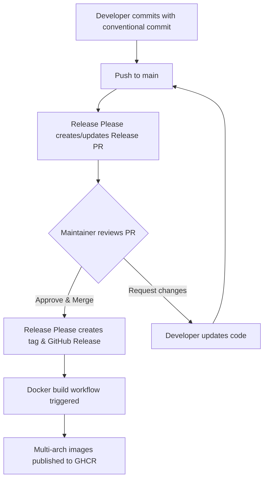

<!--
SPDX-FileCopyrightText: Copyright (c) 2025 Broadsage <opensource@broadsage.com>

SPDX-License-Identifier: Apache-2.0
-->

# Release Process

This document describes the automated release process for docker-scaffold using Release Please.

## Overview

docker-scaffold uses [Release Please](https://github.com/googleapis/release-please) to automate:

- Version bumping (semantic versioning)
- CHANGELOG generation
- GitHub Release creation
- Docker image publishing

## How It Works



## Conventional Commits

All commits to `main` must follow the [Conventional Commits](https://www.conventionalcommits.org/) format:

```bash
<type>(<scope>): <subject>

<body>

<footer>
```

### Types and Version Bumps

| Type | Version Bump | Example |
| ---- | ------------ | ------- |
| `feat:` | Minor (1.0.0 → 1.1.0) | `feat: add template versioning system` |
| `fix:` | Patch (1.0.0 → 1.0.1) | `fix: resolve Docker build failure` |
| `feat!:` or `BREAKING CHANGE:` | Major (1.0.0 → 2.0.0) | `feat!: migrate to Ansible 3.0` |
| `docs:`, `chore:`, `refactor:`, etc. | No bump (included in CHANGELOG) | `docs: update README` |

### Examples

**Feature (Minor Version):**

```bash
git commit -m "feat: add Python-based version management

- Consolidate version logic into release.py
- Use ruamel.yaml for format-preserving updates
- Support Docker-based version checking"
```

**Bug Fix (Patch Version):**

```bash
git commit -m "fix: correct .dockerignore to include entrypoint.sh

Previously excluded essential build files causing CI failures"
```

**Breaking Change (Major Version):**

```bash
git commit -m "feat!: migrate to Cookiecutter 3.0

BREAKING CHANGE: Requires Python 3.10+ and Cookiecutter 3.0
or higher. Projects using Python 3.9 must upgrade."
```

**Non-versioned (Chore):**

```bash
git commit -m "chore: update dependencies

- Bump PyYAML to 6.0.2
- Update ansible to 2.20.1"
```

## Release Workflow

### 1. Development Phase

Developers work on features/fixes and commit with conventional commit messages:

```bash
# Make changes
git add .
git commit -m "feat: add new feature"
git push origin feature-branch

# Create PR
gh pr create --title "feat: add new feature"
```

### 2. Pull Request Validation

When a PR is opened, GitHub Actions validates:

- ✅ Conventional commit format (PR title)
- ✅ DCO sign-off (`--signoff`)
- ✅ Code quality (linting, tests)

### 3. Merge to Main

After PR approval and merge:

```bash
# Merge PR (squash merge recommended)
gh pr merge --squash
```

### 4. Release Please Creates Release PR

Within minutes, Release Please will:

- Analyze commits since last release
- Determine next version (e.g., 1.0.0 → 1.1.0)
- Create/update a Release PR with:
  - Updated `VERSION` file
  - Updated `CHANGELOG.md`
  - PR title: `chore(release): 1.1.0`

**Example Release PR:**

```bash
Title: chore(release): 1.1.0

Changes:
- VERSION: 1.0.0 → 1.1.0
- CHANGELOG.md: Added new entries

Features:
- feat: add Python-based version management
- feat: add template versioning system

Bug Fixes:
- fix: correct .dockerignore to include entrypoint.sh
```

### 5. Review Release PR

Maintainers should review the Release PR:

```bash
# View the Release PR
gh pr view <number>

# Check the version bump is correct
git diff VERSION

# Review CHANGELOG entries
git diff CHANGELOG.md

# If needed, edit CHANGELOG before merging
gh pr checkout <number>
# Edit CHANGELOG.md
git add CHANGELOG.md
git commit -m "docs: update CHANGELOG"
git push
```

### 6. Merge Release PR

When ready to release:

```bash
# Merge the Release PR (use squash or merge commit)
gh pr merge <number> --squash

# Alternative: Merge via GitHub UI
```

### 7. Automated Release

After merging the Release PR, Release Please automatically:

1. Creates git tag (e.g., `v1.1.0`)
2. Creates GitHub Release with CHANGELOG notes
3. Triggers Docker build workflow

### 8. Docker Image Publication

The Docker build workflow:

1. Reads `VERSION` file (1.1.0)
2. Builds multi-arch images (amd64, arm64)
3. Publishes to GHCR with tags:
   - `ghcr.io/broadsage/scaffold:1.1.0`
   - `ghcr.io/broadsage/scaffold:1.1`
   - `ghcr.io/broadsage/scaffold:1`
   - `ghcr.io/broadsage/scaffold:latest`
   - `ghcr.io/broadsage/scaffold:sha-abc1234`

## Manual Release Triggering

### Force a Specific Version

To release a specific version, add `Release-As` to a commit:

```bash
# Create empty commit with Release-As footer
git commit --allow-empty -m "chore: release 2.0.0" -m "Release-As: 2.0.0"
git push origin main
```

Release Please will create a PR for version 2.0.0.

### Re-run Release Please

If Release Please didn't create a PR when expected:

1. Check for existing `autorelease: pending` label on old PRs
2. Remove the label if found
3. Re-run the workflow:

```bash
# Trigger manually via GitHub UI
# Actions → Release Please → Run workflow

# Or add label to merged PR
gh pr edit <number> --add-label "release-please:force-run"
```

## Troubleshooting

### Release PR Not Created

### Check 1: Ensure releasable commits exist

Release Please only creates PRs for commits with these types:

- `feat:`, `fix:`, `perf:`, `revert:`
- Language-specific: `docs:` (some languages)

Commits with `chore:`, `build:`, `ci:` alone won't trigger a release.

### Check 2: Look for pending release labels

```bash
# Search for PRs with pending label
gh pr list --label "autorelease: pending"

# If found and already released, remove label
gh pr edit <number> --remove-label "autorelease: pending"
```

### Check 3: Check workflow logs

```bash
# View recent workflow runs
gh run list --workflow=release-please.yaml

# View specific run
gh run view <run-id>
```

### Docker Build Failed After Release

Check the Docker build workflow:

```bash
# View Docker build runs
gh run list --workflow=docker-build.yaml

# View failed run details
gh run view <run-id> --log-failed
```

Common issues:

- VERSION file not found → Check it was committed
- Build context issues → Check .dockerignore
- Registry authentication → Check GITHUB_TOKEN permissions

### CHANGELOG Formatting Issues

If CHANGELOG entries are incorrect, you can fix them before merging the Release PR:

```bash
# Checkout the release branch
gh pr checkout <release-pr-number>

# Edit CHANGELOG.md manually
vim CHANGELOG.md

# Commit changes
git add CHANGELOG.md
git commit -m "docs: fix CHANGELOG formatting"
git push

# Merge when ready
gh pr merge
```

## Best Practices

### 1. Use Squash Merge

Enable squash merges in repository settings. This gives you one clean commit per PR with a proper conventional commit message.

### 2. Write Good PR Titles

PR titles become commit messages when squashed. Make them descriptive:

✅ Good: `feat: add Python-based version management with Docker integration`  
❌ Bad: `update files`

### 3. Review Release PRs Promptly

Don't let Release PRs accumulate. Review and merge them regularly to keep versions current.

### 4. Test Before Releasing

Before merging a Release PR:

1. Pull the branch locally
2. Test template generation: `cookiecutter .`
3. Test version checking: `task template:check`
4. Run compliance: `task compliance`

### 5. Document Breaking Changes

For breaking changes, include migration instructions in commit body:

```bash
git commit -m "feat!: migrate to Ansible 3.0

BREAKING CHANGE: Requires Ansible 3.0 or higher.

Migration steps:
1. Update ansible dependency: pip install ansible>=3.0
2. Review playbook syntax changes
3. Update custom tasks if any"
```

## Version Strategy

- **Patch (0.0.x)**: Bug fixes, documentation updates
- **Minor (0.x.0)**: New features, backwards-compatible changes
- **Major (x.0.0)**: Breaking changes requiring user action

## Support

For questions or issues with the release process:

- Open an issue: <https://github.com/broadsage/docker-scaffold/issues>
- Check Release Please docs: <https://github.com/googleapis/release-please>
